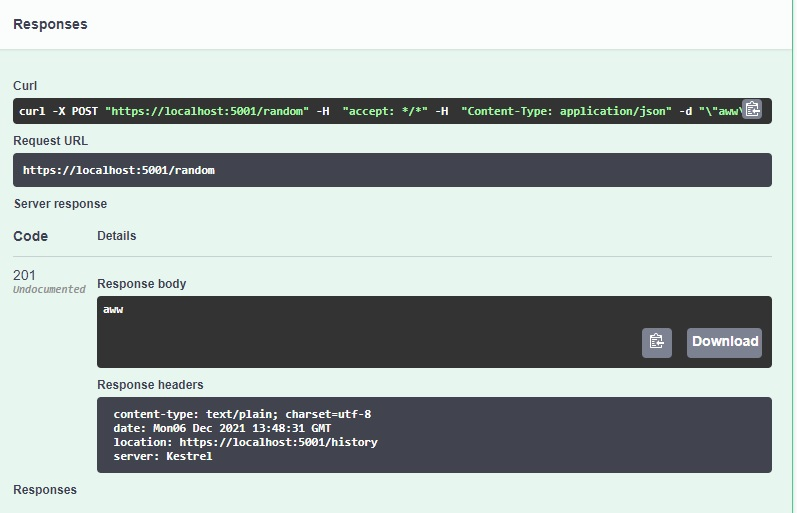

# RedditImageSelector

Selects a random image url and select date to json file and return all selected image url and select date as json
/random is post method which requires string in body and it should be application/json
/history is get method return json list

## Demonstration with Postman by using docker image and port 8080

- /random
  
- /history
  

## Demonstration with Swagger without docker image

- Random after execute
  
  
- History after execute
  
